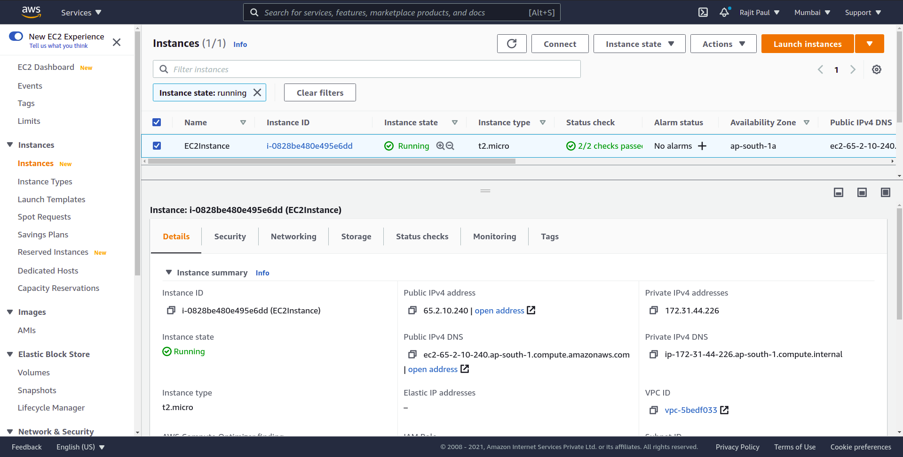
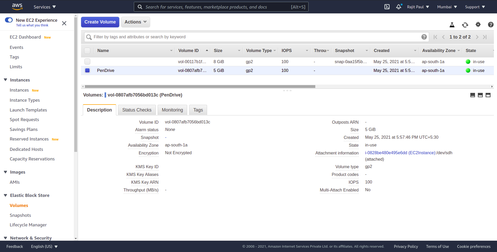

<h3>AWS EC2</h3>
Amazon Elastic Compute Cloud (Amazon EC2) is a web service that provides secure, resizable compute capacity in the cloud. It is designed to make web-scale cloud computing easier for developers. Amazon EC2’s simple web service interface allows you to obtain and configure capacity with minimal friction. It provides you with complete control of your computing resources and lets you run on Amazon’s proven computing environment.
<i>[ source-aws.amazon.com ]</i>

<h3>AWS Security Group</h3>
A security group acts as a virtual firewall for your EC2 instances to control incoming and outgoing traffic. Inbound rules control the incoming traffic to your instance, and outbound rules control the outgoing traffic from your instance. When you launch an instance, you can specify one or more security groups. If you don't specify a security group, Amazon EC2 uses the default security group. You can add rules to each security group that allow traffic to or from its associated instances. You can modify the rules for a security group at any time. New and modified rules are automatically applied to all instances that are associated with the security group. When Amazon EC2 decides whether to allow traffic to reach an instance, it evaluates all of the rules from all of the security groups that are associated with the instance.
<i>[ source-aws.amazon.com ]</i>

<h3>AWS EBS</h3>
Amazon Elastic Block Store (EBS) is an easy to use, high-performance, block-storage service designed for use with Amazon Elastic Compute Cloud (EC2) for both throughput and transaction intensive workloads at any scale. A broad range of workloads, such as relational and non-relational databases, enterprise applications, containerized applications, big data analytics engines, file systems, and media workflows are widely deployed on Amazon EBS.
<i>[ source-aws.amazon.com ]</i>
 
 

 
 

